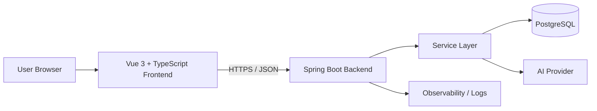

# Tukan


[](./LICENSE)

# Tukan Nutrition
Experiência Criativa: Projetando Sistemas de Informação - Cleverson Avelino e Vinícius G. Mendonça

Tukan is a full-stack web application for AI-assisted nutrition and training workflows. It pairs a Vue 3 + TypeScript frontend with a Spring Boot backend and PostgreSQL persistence, with AI-provider access kept on the server side rather than in the browser.

---

## Integrantes

- Adrian Antonio de Souza Gomes
- Edmund Soares de Sousa
- Lucas Azzolin Haubmann
- Vinicius Lima Teider

---

## Executive Summary

This README is structured for public GitHub audiences first: it explains what the project does, why it is useful, how to run it locally, how to deploy it, and how to contribute. That matches GitHub’s own guidance for repository READMEs and public repository hygiene, where the README, license, and contributor guidance are part of the first impression and onboarding path for developers, evaluators, and contributors. 

For reproducibility, the setup below assumes a public mono-repo with `frontend/` and `backend/` directories, npm on the frontend, PostgreSQL as the primary database, and either Maven Wrapper or Gradle Wrapper on the backend. For a fresh setup, the current official Vue/Vite path expects Node.js `^20.19.0 || >=22.12.0`, while current Spring Boot docs require Java 17+, Maven 3.6.3+, or Gradle 8.14+/9.x. If the repository pins stricter versions in wrappers, lockfiles, or CI, the repository should take precedence over this README. 

For discoverability, keep this README aligned with the repository description, topics, `LICENSE`, `CONTRIBUTING.md`, and workflow status badge. GitHub surfaces these files and metadata directly in the repository experience, which makes onboarding faster and reduces avoidable friction for new contributors. 

## Project Snapshot

Tukan is designed as a browser-based client talking to a standalone REST API. The frontend is optimized for developer experience and typed UI work through Vue 3, TypeScript, and Vite; the backend is optimized for structured business logic, externalized configuration, and production-style packaging through Spring Boot. PostgreSQL is used as the relational data store, and AI-related secrets should remain backend-only because Vite exposes `VITE_*` environment variables to client bundles. 

**Key features**

- AI-assisted nutrition and training recommendations
- Vue 3 + TypeScript single-page frontend
- Spring Boot REST API with environment-based configuration
- PostgreSQL-backed persistence
- Static-frontend / stateless-backend deployment model
- Public-ready documentation, testing, and contribution flow

**Tech stack**

| Layer | Technology | Role in the system |
|---|---|---|
| Frontend | Vue 3 | Component-based user interface |
| Frontend | TypeScript | Static typing for UI code and API contracts |
| Frontend | Vite | Dev server and production build pipeline |
| Backend | Spring Boot | Stand-alone, production-grade Java application |
| Backend | Maven or Gradle | Build, test, run, package, and image creation |
| Database | PostgreSQL | Relational persistence |
| CI/CD | GitHub Actions | Suggested CI/CD baseline for public GitHub repos |
| Deployment | Static hosting + JVM or OCI image | Split delivery model for frontend and backend |

Vue’s official tooling path uses `create-vue` on top of Vite and supports TypeScript-ready project scaffolding. Spring Boot is explicitly designed for stand-alone, production-grade applications that can run via `java -jar`, and GitHub Actions provides official guides for Node.js and Java CI workflows. 

## Architecture

**ASCII architecture**

```text
+-------------------------+        HTTPS / JSON        +-----------------------------+
| Browser                 |  <---------------------->  | Spring Boot REST API        |
| Vue 3 + TypeScript SPA  |                            | Controllers / Services      |
| Built with Vite         |                            | Validation / AI Orchestration|
+-------------------------+                            +-----------------------------+
                                                                  |
                                                                  | JDBC
                                                                  v
                                                        +-------------------+
                                                        | PostgreSQL        |
                                                        | Relational Store  |
                                                        +-------------------+
                                                                  |
                                                                  | Provider SDK / HTTPS
                                                                  v
                                                        +-------------------+
                                                        | AI Provider       |
                                                        | Model Inference   |
                                                        +-------------------+
```

**Mermaid flowchart**



GitHub renders Mermaid diagrams directly in Markdown, so the flowchart above can live in `README.md` without needing a screenshot or exported image. 

**Architectural decisions and trade-offs**

| Decision | Why it helps | Trade-off |
|---|---|---|
| Vue 3 + TypeScript SPA | Fast iteration, typed components, clean API-client contracts | Client-side rendering is simple to ship but is not a full SSR/SEO solution |
| Spring Boot backend | Mature Java ecosystem, clear layering, easy packaging as JAR or OCI image | A single backend remains simpler than microservices but scales less independently |
| PostgreSQL as primary store | Strong relational integrity, SQL tooling, stable local/dev/prod path | Schema changes need discipline and migrations |
| AI calls only from the backend | Keeps provider keys out of the browser and centralizes policy checks | Adds latency and cost to relevant requests |
| Externalized configuration | Easier environment parity across local, CI, and production | More initial setup work than hardcoded config |
| Static frontend + stateless backend | Clean deployment split and simpler rollback strategy | Requires coordinating two deployment artifacts |

The backend-only AI boundary is the right default for public web apps because Vite intentionally exposes only `VITE_*` variables to client-side code, while Spring Boot is built around externalized configuration through YAML, environment variables, and command-line arguments. For AI-specific risk controls, NIST’s AI RMF and OWASP’s GenAI guidance both reinforce governance, prompt-injection awareness, and safer output handling. 

**Assumed repository structure**

```text
.
├─ frontend/
│  ├─ public/
│  ├─ src/
│  │  ├─ assets/
│  │  ├─ components/
│  │  ├─ composables/
│  │  ├─ router/
│  │  ├─ services/
│  │  ├─ stores/
│  │  ├─ types/
│  │  └─ views/
│  ├─ .env.example
│  ├─ package.json
│  └─ vite.config.ts
├─ backend/
│  ├─ src/
│  │  ├─ main/
│  │  │  ├─ java/
│  │  │  └─ resources/
│  │  │     └─ application.yml
│  │  └─ test/
│  ├─ pom.xml
│  └─ build.gradle
├─ .github/
│  ├─ workflows/
│  └─ CONTRIBUTING.md
├─ docs/
├─ LICENSE
└─ README.md
```

## Configuration

**Environment variables**

| Layer | Variable | Required | Example | Purpose |
|---|---|---:|---|---|
| Frontend | `VITE_API_BASE_URL` | Yes | `http://localhost:8080` | Base URL for the backend API |
| Frontend | `VITE_APP_NAME` | No | `Tukan` | Optional UI label |
| Frontend | `VITE_ENABLE_AI_UI` | No | `true` | Feature flag for AI-facing UI elements |
| Backend | `SERVER_PORT` | No | `8080` | HTTP port for the Spring Boot app |
| Backend | `SPRING_PROFILES_ACTIVE` | No | `dev` | Active Spring profile |
| Backend | `DB_HOST` | Yes | `localhost` | PostgreSQL hostname |
| Backend | `DB_PORT` | No | `5432` | PostgreSQL port |
| Backend | `DB_NAME` | Yes | `tukan` | Database name |
| Backend | `DB_USER` | Yes | `tukan` | Database user |
| Backend | `DB_PASSWORD` | Yes | `change-me` | Database password |
| Backend | `CORS_ALLOWED_ORIGINS` | Yes | `http://localhost:5173` | Allowed frontend origins |
| Backend | `AI_ENABLED` | No | `false` | Enables backend AI integration |
| Backend | `AI_PROVIDER` | No | `openai` | Provider label used by backend config |
| Backend | `AI_MODEL` | No | `gpt-4.1-mini` | Model identifier |
| Backend | `AI_API_KEY` | If AI is enabled | `***` | Provider secret; never expose client-side |

Vite exposes environment variables through `import.meta.env` and only variables prefixed with `VITE_` are exposed to browser code, which means they must never contain secrets. Spring Boot supports YAML files, environment variables, and command-line arguments as standard configuration sources. 

**Frontend `.env.example`**

```dotenv
VITE_API_BASE_URL=http://localhost:8080
VITE_APP_NAME=Tukan
VITE_ENABLE_AI_UI=true
```

**Backend `application.yml`**

```yaml
server:
  port: ${SERVER_PORT:8080}

spring:
  application:
    name: tukan-api

  datasource:
    url: jdbc:postgresql://${DB_HOST:localhost}:${DB_PORT:5432}/${DB_NAME:tukan}
    username: ${DB_USER:tukan}
    password: ${DB_PASSWORD:change-me}

  jpa:
    hibernate:
      ddl-auto: validate
    open-in-view: false

management:
  endpoints:
    web:
      exposure:
        include: health,info

app:
  cors:
    allowed-origins: ${CORS_ALLOWED_ORIGINS:http://localhost:5173}
  ai:
    enabled: ${AI_ENABLED:false}
    provider: ${AI_PROVIDER:none}
    model: ${AI_MODEL:}
    api-key: ${AI_API_KEY:}
```

This sample uses Spring Boot placeholder binding so the same application can run locally, in CI, or in production without hardcoding environment-specific values. On the frontend, keep secrets out of `.env`; on the backend, prefer real environment variables or your deployment platform’s secret store. 

## Local Setup and Deployment

**Prerequisites**

| Dependency | Baseline |
|---|---|
| Node.js | `^20.19.0 || >=22.12.0` |
| npm | Current version compatible with the Node version above |
| Java | 17 or newer |
| Maven | 3.6.3+ if using Maven |
| Gradle | 8.14+ or 9.x if using Gradle |
| PostgreSQL | Any supported version compatible with your JDBC driver; examples below use the official Docker image |

The Node and Java baselines above follow the current official Vue/Vite and Spring Boot documentation. Vite’s default dev server port is `5173`; Spring Boot’s default application port is `8080` unless overridden; `vite preview` typically serves the production build locally on `4173`. 

**Database setup**

The official PostgreSQL Docker image accepts `POSTGRES_PASSWORD` as the required variable, while `POSTGRES_USER` and `POSTGRES_DB` are optional. PostgreSQL also supports creating a database through `CREATE DATABASE` or the `createdb` utility. 

```bash
# Start PostgreSQL with Docker
docker run --name tukan-postgres \
  -e POSTGRES_DB=tukan \
  -e POSTGRES_USER=tukan \
  -e POSTGRES_PASSWORD=change-me \
  -p 5432:5432 \
  -d postgres:18
```

```bash
# Alternative: create the DB manually with psql
psql -U postgres -d postgres
```

```sql
CREATE USER tukan WITH PASSWORD 'change-me';
CREATE DATABASE tukan OWNER tukan;
```

**Backend run**

Spring Boot can be started with the Maven plugin (`spring-boot:run`), the Gradle `bootRun` task, or as a packaged executable JAR. It also supports OCI image creation through Cloud Native Buildpacks. 

```bash
# Maven Wrapper
cd backend
./mvnw spring-boot:run
```

```bash
# Gradle Wrapper
cd backend
./gradlew bootRun
```

If the backend starts successfully, it should be reachable at:

```text
http://localhost:8080
```

**Frontend run**

The official Vue workflow uses `create-vue`, which scaffolds a Vite-powered project. In a standard Vite app, `npm run dev` starts the dev server, `npm run build` creates the production bundle, and `npm run preview` locally previews that bundle. 

```bash
cd frontend
npm install
npm run dev
```

If the frontend starts successfully, it should be reachable at:

```text
http://localhost:5173
```

**Frontend deployment**

For production, build the Vite app and deploy the generated `dist/` folder to a static host such as Nginx, Netlify, Vercel, or any equivalent static file platform. Use `npm run preview` only to validate the build locally; it is not the production hosting strategy. 

```bash
cd frontend
npm ci
npm run build
npm run preview
```

**Backend deployment**

For a JVM deployment, package the backend and run the executable JAR. For a container-first deployment, build an OCI image through Spring Boot’s buildpacks support; the official docs note these images build and run as non-root by default. 

```bash
# Maven JAR build
cd backend
./mvnw test
./mvnw package
java -jar target/*.jar
```

```bash
# Gradle JAR build
cd backend
./gradlew test
./gradlew bootJar
java -jar build/libs/*.jar
```

```bash
# Maven OCI image
cd backend
./mvnw spring-boot:build-image
```

```bash
# Gradle OCI image
cd backend
./gradlew bootBuildImage
```

## Scripts, Testing, and CI/CD

**Recommended script matrix**

| Layer | Command | Purpose | Notes |
|---|---|---|---|
| Frontend | `npm install` | Install dependencies | Use `npm ci` in CI |
| Frontend | `npm run dev` | Start Vite dev server | Local development |
| Frontend | `npm run build` | Build production assets | Outputs to `dist/` |
| Frontend | `npm run preview` | Preview production build locally | Validation only |
| Frontend | `npm run lint` | Lint frontend code | If ESLint is configured |
| Frontend | `npm run type-check` | Run TS / Vue type checks | If script is configured |
| Frontend | `npm run test:unit` | Run unit tests | Recommended with Vitest |
| Backend Maven | `./mvnw spring-boot:run` | Run backend locally | Development |
| Backend Maven | `./mvnw test` | Run tests | CI baseline |
| Backend Maven | `./mvnw package` | Build executable artifact | Produces JAR/WAR |
| Backend Maven | `./mvnw spring-boot:build-image` | Build OCI image | Container deployment |
| Backend Gradle | `./gradlew bootRun` | Run backend locally | Development |
| Backend Gradle | `./gradlew test` | Run tests | CI baseline |
| Backend Gradle | `./gradlew bootJar` | Build executable JAR | Packaged deployment |
| Backend Gradle | `./gradlew bootBuildImage` | Build OCI image | Container deployment |

Vite’s standard scaffold uses `dev`, `build`, and `preview` scripts, and Vue recommends Vitest as the natural unit-testing fit for Vite-based Vue applications. On the backend, Spring Boot’s official plugin tasks cover local run, executable packaging, and OCI image creation for both Maven and Gradle. 

**CI/CD hints**

A sensible public GitHub baseline is to run frontend and backend checks in separate jobs, cache dependencies, fail the pipeline on lint/test/build errors, publish artifacts, and only deploy after quality gates pass. GitHub provides official CI guides for Node.js, Java with Maven, and Java with Gradle, and supports status badges that can be shown directly in the README. 

Use this minimum pipeline order:

- Frontend: install → lint → type-check → unit tests → build
- Backend: test → package → publish artifact or image
- Deployment: frontend `dist/` to static hosting, backend JAR or OCI image to the chosen runtime
- Secrets: store database credentials and AI keys in CI secrets, never in Vite `VITE_*` variables 

If you publish on GitHub, the badge at the top of this README can use the built-in workflow status badge format, while the static technology badges can be generated through Shields. 

## Contribution, License, and Changelog

For public repositories, keep contributor instructions in `CONTRIBUTING.md` at the repository root, `docs/`, or `.github/`, because GitHub surfaces that file to people opening issues and pull requests. Keep the README focused on project overview and setup, and put contribution rules, PR templates, issue templates, and community health files under `.github/` or adjacent docs. 

**Contribution guidelines**

- Fork the repository and create a focused branch for each change.
- Open an issue before large feature work or architectural changes.
- Keep pull requests small, reviewable, and linked to an issue when possible.
- Run frontend and backend checks locally before opening a PR.
- Update `README.md`, `.env.example`, and API/config docs whenever behavior changes.
- Put repository-specific rules in [`CONTRIBUTING.md`](./CONTRIBUTING.md).

**License**

GitHub recommends shipping a real `LICENSE` file in the repository root. For a public academic or open-source release, MIT is a practical permissive default, which is why the badge above uses MIT; if Tukan is institution-restricted or proprietary, replace both the badge and the `LICENSE` file before publishing.
